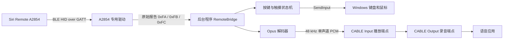

# Apple TV Siri Remote A2854 自定义驱动与后台软件开发计划

## 1. 文档状态

- 当前状态：需求已确认，可以开始阶段 0
- 目标设备：Apple TV Siri Remote 第三代，型号 A2854
- 目标系统：Windows 10 22H2 x64、Windows 11 23H2/24H2 x64
- 开发起点：空项目，仅复用 `参考项目/siri-remote` 中已经验证过的协议知识和测试数据
- 方案形式：A2854 专用 Windows 驱动 + 当前用户会话中的后台程序
- 语音输出：转发到用户预先安装的虚拟声卡，第一版不开发自有虚拟麦克风驱动
- 交付方式：内部自用，开发和交付阶段使用测试签名

## 2. 总体结论

项目分成两个边界清晰的组件：

1. **A2854 专用驱动**
   - 只负责接管遥控器的 HID over GATT 服务。
   - 完成 GATT 初始化、通知订阅、断线处理和原始报告转发。
   - 不解析按键业务，不计算手势，不解码 Opus，不操作 Windows 键盘、鼠标或音频。

2. **后台程序**
   - 读取驱动转发的原始报告。
   - 解析按键、触摸和麦克风协议。
   - 根据 `按键映射关系.md` 执行 Windows 输入映射。
   - 将 Opus 语音解码为 PCM，并写入 VB-CABLE 等虚拟声卡的播放端点。

这样可以把高风险、难调试的驱动部分控制在最小范围内，协议和映射逻辑则保留在普通 C# 程序中，便于测试和修改。



## 3. 第一项工作：验证驱动接管是否成立

Windows 已经为 Bluetooth LE HID 提供 `HidBthLE.dll`。目前 A2854 配对后正是在这一层启动失败，而且普通 GATT 程序被系统拒绝访问。因此，不能在计划中直接假定自定义驱动一定能访问 `0x1812`；必须先完成一个独立的驱动可行性验证。

### 3.1 验证目标

1. 获取物理测试机上 A2854 的完整 PnP 设备树、硬件 ID、兼容 ID、当前驱动和错误状态。
2. 确认 HID 服务节点是否为类似下列形式：

   ```text
   BTHLEDevice{00001812-0000-1000-8000-00805f9b34fb}_Dev_VID&..._PID&..._REV&...
   ```

3. 编写只匹配 A2854 完整硬件 ID 的最小测试驱动，不能匹配所有 `0x1812` 设备，避免影响其他蓝牙键盘和鼠标。
4. 优先验证 UMDF 2 用户模式驱动能否替代该设备上的系统 `HidBthLE` 功能驱动，并通过 Windows 提供的设备接口访问 GATT 服务。
5. 如果 UMDF 2 无法完成，再评估 KMDF 或设备筛选驱动；不依赖未公开、随 Windows 版本变化的私有 IOCTL 作为正式方案。
6. 驱动必须实际完成以下操作，验证才算通过：
   - 枚举 HID 服务 `0x1812`。
   - 枚举八个同 UUID 的 Report 特征 `0x2A4D`。
   - 读取每个 Report Reference 描述符 `0x2908`，得到报告 ID 和类型。
   - 订阅全部可通知的 Input Report。
   - 向所有可写的非 Input Report 写入初始化字节 `0xAF`。
   - 收到实体按键报告 `0xFB`。
   - 收到触摸报告 `0xFC`。
   - 按住语音键时收到麦克风报告 `0xFA`。
   - 遥控器断开并重新连接后能够恢复报告流。

### 3.2 阶段出口

- **通过**：开始正式驱动和后台程序开发。
- **失败**：停止后续实现并报告阻断原因。项目不接受专用 USB BLE 适配器，也不把未公开的 Windows 蓝牙私有接口作为默认实现。若仍要继续，必须由项目负责人另行批准新的技术路线。

在完成这一阶段前，不承诺 MAP-01 至 MAP-20 可以在 Windows 上交付。

## 4. 技术选型

| 部分 | 第一版选择 | 说明 |
| --- | --- | --- |
| 目标平台 | Windows 10 22H2、Windows 11 23H2/24H2，x64 | 两个系统都需要物理机验收 |
| 驱动框架 | 优先 UMDF 2，可行性验证后再决定是否需要 KMDF | 尽量减少内核代码和蓝屏风险 |
| 驱动语言 | C++ | 使用 Visual Studio 和 WDK |
| 后台程序 | C#、.NET 10、x64 | 在当前登录用户会话中运行 |
| 托盘界面 | WinForms | 提供状态、设置、日志和退出入口 |
| 驱动通信 | 设备接口 + 异步 IOCTL | 后台程序持续提交读取请求 |
| 键鼠映射 | Win32 `SendInput` | 第一版只覆盖普通桌面应用 |
| Opus 解码 | libopus | 与参考项目保持一致 |
| 音频输出 | WASAPI 共享模式 | 输出到用户选择的虚拟声卡播放端点 |
| 虚拟声卡 | VB-CABLE | 由用户单独安装 |
| 配置 | 单个 JSON 文件 | 保存设备、灵敏度、音频端点等少量设置 |
| 日志 | 文本滚动日志 | 驱动只记录必要事件，详细日志放在后台程序 |

后台程序必须运行在交互式用户会话中，不能只做成 LocalSystem Windows 服务。Windows 服务位于 Session 0，无法可靠地向当前用户桌面注入键盘和鼠标输入。

管理员窗口、UAC 安全桌面和登录界面的输入映射不在项目范围内，因此不开发 Virtual HID Framework 驱动。

## 5. 驱动设计

### 5.1 驱动职责

- 只绑定 A2854 的 HID over GATT 服务节点。
- 处理设备启动、停止、移除、断线、重新连接和电源状态变化。
- 枚举并保存每个 `0x2A4D` 特征对应的报告 ID、报告类型和访问能力。
- 在通知订阅完成后写入 `0xAF`。
- 将每个输入报告按接收顺序转发给后台程序。
- 后台程序退出时保持设备状态正确；后台程序再次启动后可以重新读取报告。
- 在设备断开或驱动停止时通知后台程序清空全部输入状态。

### 5.2 驱动明确不负责的内容

- 不识别短按、长按或双击。
- 不解析触摸坐标。
- 不执行键盘、鼠标和音量操作。
- 不解码 Opus。
- 不连接虚拟声卡。
- 不保存用户配置。
- 不提供图形界面。

### 5.3 最小通信接口

第一版只保留三个接口：

| 接口 | 用途 |
| --- | --- |
| `GET_DEVICE_INFO` | 返回驱动版本、设备连接状态和设备标识 |
| `READ_EVENT` | 异步读取下一条原始报告或连接状态事件 |
| `REINITIALIZE` | 调试时重新执行订阅和 `0xAF` 初始化 |

每条报告至少包含：

```text
事件类型
报告 ID
载荷长度
单调递增序号
原始载荷
```

驱动内部使用一个有界队列。队列满时丢弃最旧报告并增加丢包计数，不能因为后台程序一时阻塞而阻塞蓝牙回调。

### 5.4 安装限制

- 开发阶段使用测试证书和测试签名。
- INF 只匹配经过确认的 A2854 硬件 ID。
- 安装和卸载必须能够恢复 Windows 原来的设备驱动。
- 正式分发前单独完成 Microsoft 驱动签名和目标 Windows 版本验证。

## 6. 后台程序设计

后台程序暂定名称为 `SiriRemoteBridge`。

### 6.1 模块划分

| 模块 | 职责 |
| --- | --- |
| `DriverClient` | 打开驱动设备接口，异步读取报告，接收连接状态 |
| `Protocol` | 纯函数解析 `0xFA`、`0xFB`、`0xFC` |
| `InputState` | 维护按下、松开、短按、长按、拖拽和滚轮状态 |
| `InputOutput` | 调用 `SendInput` 发送键盘和鼠标事件 |
| `TouchPointer` | 将相邻触摸坐标差转换为鼠标相对位移 |
| `VoiceSession` | 管理语音键按下到松开的完整音频会话 |
| `OpusDecoder` | Opus 解码和少量丢包补偿 |
| `AudioOutput` | 枚举并打开虚拟声卡的 WASAPI 播放端点 |
| `Configuration` | 读取和保存 JSON 配置 |
| `Logging` | 记录连接、输入、音频和异常信息 |
| `TrayUi` | 显示连接和语音状态，打开设置、日志及退出程序 |

协议解析必须保持为不依赖驱动、不依赖 Windows UI 的普通 C# 类库，以便使用参考项目中的原始数据做单元测试。

### 6.2 进程形式

第一版包含托盘设置界面，按以下顺序开发：

1. 控制台诊断程序，方便观察原始报告和映射状态。
2. 完成当前用户会话中的 WinForms 托盘程序。
3. 托盘菜单提供设备状态、音频端点设置、指针参数、打开日志和退出。
4. 支持当前用户登录后自动启动。

控制台诊断程序与托盘程序复用同一套协议和映射类库。不开发 Windows 服务。

## 7. 协议实现

### 7.1 按键报告 `0xFB`

- 长度：2 字节，小端 `uint16` 掩码。
- 已知位：

| 位掩码 | 按键 |
| --- | --- |
| `0x0001` | TV/控制中心 |
| `0x0002` | 音量加 |
| `0x0004` | 音量减 |
| `0x0008` | Clickpad 中心 |
| `0x0010` | 电源 |
| `0x0020` | 语音 |
| `0x0040` | 返回 |
| `0x0080` | 静音 |
| `0x0100` | 播放/暂停 |
| `0x0200` | 上 |
| `0x0400` | 右 |
| `0x0800` | 下 |
| `0x1000` | 左 |

解析器保存上一帧掩码，通过位差得到本帧的按下和松开事件。

### 7.2 触摸报告 `0xFC`

- 单指报告长度：11 字节。
- 双指报告长度：18 字节。
- 首字节标记：`0x32`。
- 第 1 至 2 字节：小端序列号。
- 每个触点占 7 字节。
- X、Y 为打包的两个 12 位有符号坐标，范围 `-2048..2047`。
- 第一版只使用第一个有效触点。
- 手指离开后清除上一个坐标，下一次接触不能产生跳变。
- 多指报告只用于诊断，不产生鼠标输出。

### 7.3 麦克风报告 `0xFA`

- 报告载荷长度：99 字节。
- 第 2 至 3 字节：小端序列号。
- 第 4 字节：Opus 帧长度。
- 第 5 字节开始：Opus 帧。
- 编码：Opus CELT，48 kHz，单声道，20 ms。
- 每个有效数据包解码为 960 个 PCM 样本。
- PCM 格式：优先 48 kHz、16 位、单声道；写入虚拟声卡前根据端点混音格式完成必要的声道复制或格式转换。
- 连续丢包最多补偿 4 帧；更大间隔直接重新同步。
- 全零或无效音频包结束当前序列跟踪。

## 8. 按键和触摸状态机

所有需要区分短按和长按的按键使用同一个 600 ms 阈值。每个按键只维护必要状态：

```text
空闲 -> 等待短按 -> 长按已触发 -> 空闲
```

- 600 ms 前松开：执行短按动作。
- 到达 600 ms：执行一次长按开始动作。
- 长按后松开：只执行长按结束动作，不再执行短按。
- 驱动断开、后台程序退出或设备移除：立即释放所有已按下的键盘和鼠标状态。

### 8.1 映射实现表

| 映射编号 | 实现方式 | 所属阶段 |
| --- | --- | --- |
| MAP-01 | 单指相邻坐标差乘灵敏度，发送相对鼠标移动 | 输入映射 |
| MAP-02、MAP-03 | 中心键短按发送一次左键点击；连续两次由 Windows 双击设置识别 | 输入映射 |
| MAP-04 | 中心键达到 600 ms 后发送一次 `Enter` | 输入映射 |
| MAP-05、MAP-06、MAP-07、MAP-08 | 方向键按下/松开分别发送对应键盘事件，由 Windows 负责按键重复 | 输入映射 |
| MAP-09 | 返回键短按发送一次 `Delete` | 输入映射 |
| MAP-10 | TV 键短按发送一次 `Alt+Tab` 组合键 | 输入映射 |
| MAP-11 | TV 键达到 600 ms 后按下鼠标左键，松开 TV 键时释放 | 输入映射 |
| MAP-12 | 静音键短按发送系统静音媒体键 | 输入映射 |
| MAP-13、MAP-14 | 音量键短按发送系统音量媒体键 | 输入映射 |
| MAP-15、MAP-16 | 音量键达到 600 ms 后按固定周期发送滚轮事件，松开即停止 | 输入映射 |
| MAP-17、MAP-18 | 语音键控制 Opus 解码和虚拟声卡写入会话 | 语音 |
| MAP-19 | 由驱动、蓝牙适配器和平台电源能力共同实现 | 条件功能 |
| MAP-20 | 播放/暂停键短按时发送一次 Windows 媒体播放/暂停键 | 输入映射 |

### 8.2 初始配置项

只提供实际需要调整的参数：

```json
{
  "pointerSensitivity": 1.0,
  "pointerDeadZone": 1,
  "longPressMilliseconds": 600,
  "wheelIntervalMilliseconds": 80,
  "audioEndpointId": ""
}
```

第一版不支持用户任意编辑每个按键映射，先严格实现 `按键映射关系.md`。电源键未定义映射，只记录诊断日志。

## 9. 语音转发

### 9.1 数据流程

1. 语音键按下，创建新的 `VoiceSession`。
2. 接收 `0xFA` 报告并校验序号和帧长度。
3. 使用 libopus 解码为 48 kHz 单声道 PCM。
4. 将 PCM 放入约 100 至 250 ms 的有界环形缓冲区。
5. WASAPI 线程持续把 PCM 写入用户选择的虚拟声卡播放端点。
6. 语音键松开、设备断开或程序退出时，停止写入并清空缓冲区。

### 9.2 端点约定

以 VB-CABLE 为例：

| 使用方 | 端点 |
| --- | --- |
| `SiriRemoteBridge` | `CABLE Input` 播放端点 |
| 语音应用 | `CABLE Output` 录音端点 |

后台程序按 Windows 音频端点 ID 保存选择，显示名称只用于用户识别。虚拟声卡不存在时，按键和触摸功能仍然可用，语音功能显示明确错误。

### 9.3 第一版不做的内容

- 不开发 ACX/WaveRT 虚拟麦克风驱动。
- 不自动修改 Windows 默认麦克风。
- 不自动修改其他应用的麦克风设置。
- 不保存或上传用户语音。
- 不做降噪、回声消除和语音识别。
- 不兼容 VB-CABLE 以外的虚拟声卡产品。

## 10. Windows 唤醒

MAP-19 不能仅由后台程序实现。驱动必须支持电源策略和 Wait/Wake，蓝牙控制器、USB/PCIe 总线、电脑固件和 Windows 电源模式也必须允许蓝牙设备唤醒系统。

因此 MAP-19 单独作为条件阶段：

1. 先完成正常运行状态下的驱动连接和全部映射。
2. 在指定物理测试机上检查蓝牙适配器是否支持从目标睡眠状态唤醒。
3. 分别测试现代待机、S3 睡眠和 S4 休眠中测试机实际支持的状态。
4. 恢复后清空旧按键和触摸状态。
5. 丢弃只用于唤醒系统的第一次按键，避免恢复后误执行映射。

如果硬件不支持，项目应显示“该电脑不支持遥控器唤醒”，不能通过软件承诺解决。

## 11. 开发阶段与交付物

### 阶段 0：需求冻结与测试环境

交付物：

- 确认目标 Windows 版本、CPU 架构和蓝牙适配器。
- 保存 A2854 的 PnP 设备树、硬件 ID 和当前驱动错误。
- 配置 Windows 10 物理测试机的 WDK 调试和测试签名环境。
- 安排 Windows 11 x64 物理机用于兼容验收。

完成条件：测试环境和第一版范围不再变化。

### 阶段 1：驱动可行性验证

交付物：

- 最小驱动工程和仅匹配 A2854 的 INF。
- 驱动安装、恢复系统驱动和诊断说明。
- 原始报告查看工具。
- 驱动验证报告。

完成条件：实际收到 `0xFB`、`0xFC`、`0xFA`，并能断线重连。

这是整个项目的硬性里程碑。失败时按第 3.2 节做路线决策。

### 阶段 2：项目骨架与协议类库

建议目录：

```text
src/
  driver/
    SiriRemoteTransport/
  app/
    SiriRemoteBridge/
  protocol/
    SiriRemote.Protocol/
tests/
  SiriRemote.Protocol.Tests/
  SiriRemote.Mapping.Tests/
tools/
  SiriRemote.RawMonitor/
installer/
docs/
```

交付物：

- 可统一构建的解决方案。
- 驱动通信定义。
- `0xFA`、`0xFB`、`0xFC` 解析器。
- 使用参考项目数据的协议单元测试。

### 阶段 3：正式驱动

交付物：

- 完整 PnP 生命周期。
- GATT 报告枚举、分类、订阅和 `0xAF` 初始化。
- 异步原始事件接口。
- 有界队列、丢包计数和连接状态事件。
- 测试签名驱动包。

完成条件：原始监视工具可以稳定运行，反复连接和断开不会残留失效设备状态。

### 阶段 4：按键与触摸映射

交付物：

- 600 ms 短按/长按状态机。
- MAP-01 至 MAP-16、MAP-20。
- 断开和退出时的完整状态释放。
- 输入状态机单元测试。

完成条件：逐项通过 `按键映射关系.md` 的手工验收。

### 阶段 5：语音转发

交付物：

- Opus 包解析、解码和丢包补偿。
- WASAPI 虚拟声卡端点选择与写入。
- MAP-17、MAP-18。
- 可从 `CABLE Output` 录制的语音验证文件。

完成条件：按住语音键可连续录音，松开后立即停止，重复会话不需要重启程序。

### 阶段 6：后台运行和安装

交付物：

- 当前用户登录后自动启动。
- WinForms 托盘图标、设置界面和日志入口。
- 设备状态、VB-CABLE 端点和输入参数配置。
- 驱动、后台程序及卸载流程。
- 卸载后恢复系统原驱动。

内部自用版本使用脚本和 `pnputil` 完成驱动安装，后台程序提供独立发布目录，不制作公开发行安装器。

### 阶段 7：睡眠恢复与唤醒

交付物：

- 睡眠恢复后的自动重连。
- MAP-19 硬件可行性报告。
- 支持的测试机上实现唤醒和首键抑制。

完成条件：只对经过验证的电脑和蓝牙适配器组合声明支持。

### 阶段 8：内部交付验证

交付物：

- Windows 目标版本兼容测试。
- 30 分钟连续按键、触摸和语音压力测试。
- 反复配对、断开、睡眠恢复测试。
- Driver Verifier 测试机验证。
- 安装、升级、卸载和故障恢复文档。
- 测试签名驱动包和内部安装说明。

## 12. 测试和验收

### 12.1 自动测试

- 每个已知按键位的按下和松开差分。
- 单指、双指、抬手和坐标边界报告。
- 12 位坐标符号扩展。
- 600 ms 前后边界的短按和长按。
- 长按后松开不触发短按。
- TV 长按拖拽完整的左键按下和松开。
- 播放/暂停键发送一次媒体播放/暂停事件。
- 断开时释放方向键、Alt、鼠标左键和滚轮状态。
- 有效、全零、截断和错误长度的 `0xFA` 包。
- Opus 序号回绕、少量丢包和大间隔重同步。

### 12.2 实机验收

- MAP-01 至 MAP-18、MAP-20 逐项验收。
- 同时操作实体鼠标、键盘时不出现卡键。
- 点击、拖拽、方向键重复和滚轮停止符合映射定义。
- 虚拟声卡切换后无需重启电脑。
- 遥控器关机、超距和重新靠近后能恢复。
- 后台程序异常退出后没有残留按键按下状态。
- 不影响电脑上的其他蓝牙 HID 设备。
- MAP-19 只在指定支持硬件上验收。

## 13. 风险

| 风险 | 影响 | 处理 |
| --- | --- | --- |
| Windows 不向第三方驱动公开可用的 HOGP/GATT 接管接口 | 自定义驱动路线无法成立 | 阶段 1 先验证，失败立即做路线决策 |
| Windows 10 与 Windows 11 的 HOGP 驱动行为不同 | 一个系统可用、另一个系统失败 | 两个系统分别使用物理机完成阶段 1 和最终验收 |
| INF 匹配范围过宽 | 影响其他蓝牙键盘和鼠标 | 只匹配 A2854 完整硬件 ID |
| `SendInput` 受权限级别限制 | 管理员窗口、UAC 或登录界面不能操作 | 项目明确只支持普通桌面应用 |
| 测试签名环境要求 | 驱动不能在未配置的电脑上直接加载 | 仅面向已配置测试签名的内部测试机 |
| 虚拟声卡格式不同 | 无声、变速或声道错误 | 使用端点混音格式并做必要转换 |
| 蓝牙丢包 | 语音出现短暂破音 | 使用序号检测和最多 4 帧 Opus PLC |
| 睡眠唤醒依赖硬件 | MAP-19 无法在所有电脑实现 | 作为条件功能，按硬件组合声明支持 |
| Apple 未公开协议 | 固件更新可能改变报告 | 保存原始日志，解析失败时保留诊断信息 |

## 14. 已确认范围与待提供信息

### 14.1 已确认

- 同时支持 Windows 10 22H2 x64 和 Windows 11 23H2/24H2 x64。
- 使用 Windows 系统蓝牙适配器，不接受专用 USB BLE 适配器。
- 输入映射只需控制普通桌面程序，使用 `SendInput`。
- 用户自行安装 VB-CABLE。
- 项目内部自用，使用测试签名。
- 第一版包含 WinForms 托盘设置界面。
- MAP-19 按“硬件支持时提供”验收。
- MAP-20 将播放/暂停键映射为 Windows 媒体播放/暂停键。
- 电源键保持未映射，只记录日志。
- 接受 600 ms 长按、80 ms 滚轮间隔、1.0 指针灵敏度等默认值。

### 14.2 开始阶段 1 前仍需取得

1. Windows 10 物理测试机的电脑型号、Windows 完整版本号和蓝牙适配器型号。
2. A2854 的 `0x1812` 服务节点完整硬件 ID、兼容 ID、当前驱动名称和设备错误代码。
3. 一台 Windows 11 x64 物理机。可以晚于 Windows 10 驱动验证，但在声明 Windows 11 支持前必须完成同样的驱动接管和功能验收。

## 15. 参考资料

- 项目按键定义：`按键映射关系.md`
- Linux 协议参考：`参考项目/siri-remote`
- Windows API 验证：`Windows官方API可行性验证报告.md`
- Microsoft HID 传输说明：<https://learn.microsoft.com/en-us/windows-hardware/drivers/hid/hid-transports>
- Microsoft Bluetooth LE 概述：<https://learn.microsoft.com/en-us/windows-hardware/drivers/bluetooth/bluetooth-low-energy-overview>
- Microsoft `SendInput`：<https://learn.microsoft.com/en-us/windows/win32/api/winuser/nf-winuser-sendinput>
- Microsoft Virtual HID Framework：<https://learn.microsoft.com/en-us/windows-hardware/drivers/hid/virtual-hid-framework--vhf->
- Microsoft 驱动测试签名：<https://learn.microsoft.com/en-us/windows-hardware/drivers/install/test-signing>
- Microsoft 驱动正式签名：<https://learn.microsoft.com/en-us/windows-hardware/drivers/dashboard/code-signing-attestation>
